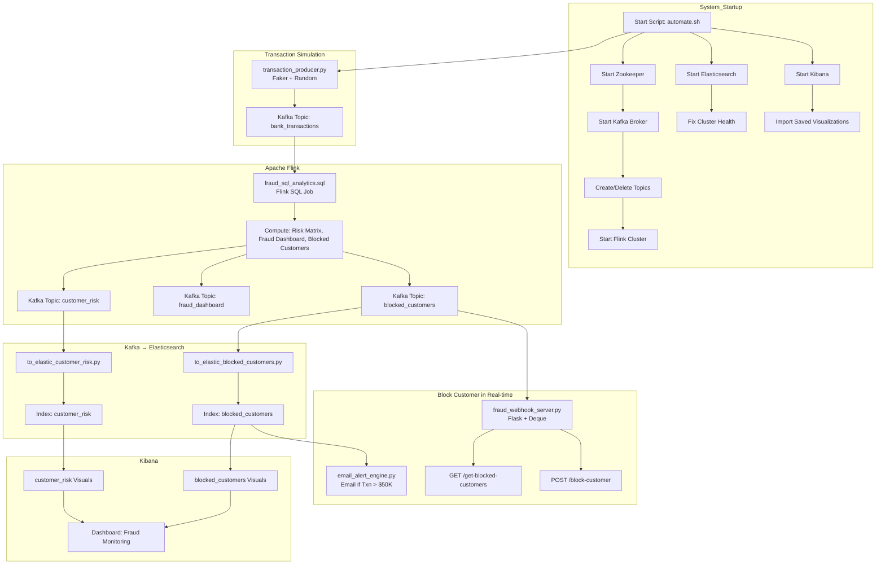

# 🛡️ Fraud Monitoring Pipeline Documentation

## 📂 Project Overview

This project simulates bank transactions, detects fraudulent activities, visualizes data in Kibana, and sends alerts for high-risk or blocked customers.

* * *

## ⚙️ Architecture Flow (Detailed Mermaid Diagram)




* * *

## 🛠️ Components Summary

### 1\. Kafka Topics:

-   `bank_transactions`: Main input stream of transactions.
-   `customer_risk`: Processed risk evaluations.
-   `fraud_dashboard`: Aggregated metrics for dashboard.
-   `blocked_customers`: Flagged users with high-risk patterns.

### 2\. Flink SQL:

-   Stream processing + SQL analytics
-   Evaluates fraud likelihood, computes metrics, flags accounts

### 3\. Elasticsearch:

-   Index: `customer_risk` for risk scoring
-   Index: `blocked_customers` for blocked profiles

### 4\. Kibana:

-   Dashboards: Real-time visualizations
-   Imported via: `import_kibana_visuals.py`

### 5\. Webhook Server (Flask):

-   Endpoint: `/block-customer` to collect blocked users
-   Endpoint: `/get-blocked-customers` returns JSON for UI

### 6\. Email Alert Engine:

-   Listens on `blocked_customers`
-   Sends email via SMTP if criteria met

### 7\. Automation Scripts:

-   `automate.sh`: Full system bootstrap
-   `fix_cluster_health.sh`: Recovers Elasticsearch to yellow/green
-   `firewall_allow.sh`: Sets GCP firewall rules
* * *

## 🧠 Working Logic

1.  **Producer** sends synthetic transactions to Kafka (`bank_transactions`).
2.  **Flink SQL** evaluates each event to determine risk & anomalies.
3.  **Metrics and flags** are streamed to other topics (`customer_risk`, `fraud_dashboard`, `blocked_customers`).
4.  **Elasticsearch consumers** index these events for Kibana.
5.  **Kibana dashboards** load saved objects and visualize the data.
6.  **Webhook server** and **Email alert engine** act on high-risk transactions.
* * *

## 📦 Directory Structure (Suggestion)

```
📁 kafka_flink/
├── automate.sh
├── fix_cluster_health.sh
├── firewall_allow.sh
├── fraud_sql_analytics.sql
├── import_kibana_visuals.py
├── email_alert_engine.py
├── to_elastic_customer_risk.py
├── to_elastic_blocked_customers.py
├── transaction_producer.py
├── transaction_consumer.py
├── fraud_alert_consumer.py
├── fraud_webhook_server.py
├── export.ndjson  # Saved Kibana dashboard
```

* * *

## 🚀 Run the Pipeline

```bash
bash automate.sh
```

-   Starts Zookeeper, Kafka, Flink, Elasticsearch, Kibana
-   Creates topics
-   Submits Flink SQL jobs
-   Starts consumers, producers, and email engine
-   Imports Kibana saved visualizations
* * *

